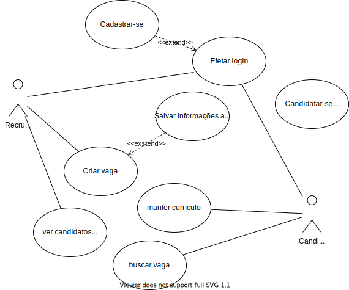

# vagas
Sistema para conectar mão de obra à vagas de emprego.

## Requisitos funcionais para a versão 1.0
1. Um recrutador pode se cadastrar.
2. Um usuário pode cadastrar seu curriculo.
3. Um recrutador pode cadastrar vagas.
4. Um usuário pode se candidatar a uma vaga.
5. As empresas podem ver os cadidatos às suas vagas.

## Requisitos não funcionais
1. Para se cadastrar como recrutador um usuário precisa de: 
    * nome completo do usuário; 
    * nome da empresa a qual faz parte;
    * cnpj da empresa a qual faz parte; 

## Casos de uso

